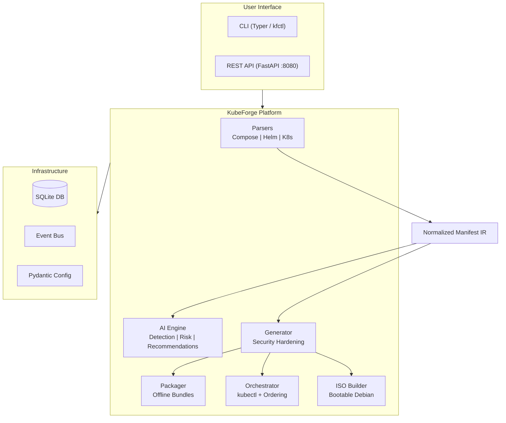

<p align="center">
  <h1 align="center">⚒️ KubeForge</h1>
  <p align="center"><strong>AI-Powered K3s Deployment Platform</strong></p>
  <p align="center">
    Transform Docker Compose, Helm charts, and Kubernetes manifests into<br>
    production-hardened, air-gap deployable K3s bundles — in a single command.
  </p>
</p>

<p align="center">
  <!-- Build & Quality -->
  <a href="https://github.com/jetendralaha/KubeForge/actions/workflows/ci.yml"></a>
  <a href="https://codecov.io/gh/jetendralaha/KubeForge"></a>
  <br>
  <!-- Package -->
  <a href="https://pypi.org/project/kubeforge/"></a>
  <br>
  <!-- Meta -->
  <a href="LICENSE"></a>
  <a href="https://github.com/jetendralaha/KubeForge/issues"></a>
  <a href="https://github.com/jetendralaha/KubeForge/pulls"></a>
  <a href="https://github.com/jetendralaha/KubeForge/stargazers"></a>
  <a href="https://github.com/jetendralaha/KubeForge/network/members"></a>
  <br>
  <!-- Tech -->
  
  
  
  
  
  
</p>

---

## 🎯 What is KubeForge?

KubeForge is an open-source platform that converts your existing container workload definitions into **production-ready, security-hardened K3s deployments**. It can optionally produce fully self-contained **bootable ISO images** for deploying to air-gapped (offline) environments with zero internet access.

**Input any of these:**
- Docker Compose files (v2/v3)
- Packaged Helm charts (`.tgz`)
- Raw Kubernetes YAML manifests

**Get production outputs:**
- Hardened K3s manifests with Pod Security Admission, Network Policies, resource limits
- Offline `.tar.gz` bundles with container images and install scripts
- Bootable Debian 12 live ISOs that deploy a full K3s cluster on first boot

---

## ✨ Key Features

| Feature | Description |
|---------|-------------|
| **Multi-format parsing** | Auto-detects and parses Docker Compose, Helm `.tgz`, and raw K8s YAML into a unified intermediate representation |
| **AI-powered security analysis** | Heuristic + LLM-based risk detection, best-practice recommendations, and artifact classification (works with Ollama, OpenAI, Azure, Groq, or any OpenAI-compatible API) |
| **Hardened manifest generation** | Applies PSA labels, default-deny NetworkPolicies, resource limits, Longhorn StorageClass, Traefik Ingress, and dedicated ServiceAccounts |
| **Offline packaging** | Exports container images (Docker/Skopeo), downloads K3s binaries, bundles manifests + install script + checksums into a `.tar.gz` |
| **Bootable ISO builder** | Creates a Debian 12 live ISO that auto-installs K3s, imports images, and applies manifests — fully air-gap safe |
| **Deployment orchestration** | Applies manifests to live clusters with dependency ordering, PaaS-first sequencing, pod readiness checks, and event-driven progress |
| **REST API + CLI** | Full FastAPI server at `:8080` with Swagger docs, plus a Typer CLI (`kubeforge` / `kfctl`) for scripting |

---

## 🏗️ Architecture



> Full architectural details → [docs/ARCHITECTURE.md](docs/ARCHITECTURE.md)

---

## 🚀 Quick Start

### Prerequisites

| Requirement | Purpose |
|-------------|---------|
| Python 3.11+ | Core runtime |
| Docker or Skopeo | Container image export (optional) |
| Helm CLI | Helm chart rendering (optional) |
| Ollama | Local AI analysis (optional) |

### Installation

```bash
# Clone and install
git clone https://github.com/jetendra/KubeForge.git
cd KubeForge
pip install -e .

# Or with all optional extras
pip install -e ".[dev,ai,iso]"
```

### Start the Server

```bash
kubeforge serve
# → API:      http://localhost:8080
# → Docs:     http://localhost:8080/docs
# → Health:   http://localhost:8080/health
```

### Example: Compose → Hardened K3s → Offline Bundle

```bash
# 1. Create a project
kubeforge project create --name wordpress-prod

# 2. Upload your docker-compose.yml
kubeforge upload --project <id> --file docker-compose.yml

# 3. Run AI security analysis
kubeforge analyze --project <id>

# 4. Generate production-hardened K3s manifests
kubeforge generate --project <id>

# 5. Package for air-gap deployment
kubeforge package --project <id>

# 6. Or create a bootable ISO
kubeforge iso --project <id>

# 7. Or deploy directly to a cluster
kubeforge deploy --project <id>
```

---

## 📡 REST API Reference

All endpoints live under `/api/v1`. Interactive Swagger docs are at `/docs`.

| Endpoint | Method | Description |
|----------|--------|-------------|
| `/api/v1/projects` | `GET` | List all projects |
| `/api/v1/projects` | `POST` | Create a new project |
| `/api/v1/projects/{id}` | `GET` | Get project details |
| `/api/v1/projects/{id}` | `DELETE` | Delete a project |
| `/api/v1/projects/{id}/artifacts` | `POST` | Upload deployment artifact |
| `/api/v1/projects/{id}/analyze` | `POST` | Run AI risk analysis |
| `/api/v1/projects/{id}/manifests` | `GET` | Retrieve generated manifests |
| `/api/v1/projects/{id}/manifests` | `POST` | Generate K3s manifests |
| `/api/v1/projects/{id}/package` | `POST` | Create offline bundle |
| `/api/v1/projects/{id}/deploy` | `POST` | Deploy to cluster |
| `/health` | `GET` | Health check + Ollama status |
| `/version` | `GET` | Version info |

---

## ⚙️ Configuration

All configuration is via environment variables (powered by `pydantic-settings`):

### Server

| Variable | Default | Description |
|----------|---------|-------------|
| `KUBEFORGE_SERVER_HOST` | `0.0.0.0` | Bind address |
| `KUBEFORGE_SERVER_PORT` | `8080` | Bind port |
| `KUBEFORGE_DATA_DIR` | `~/.kubeforge` | Data directory for DB, artifacts, outputs |
| `KUBEFORGE_LOG_LEVEL` | `INFO` | Logging level |

### AI / LLM

| Variable | Default | Description |
|----------|---------|-------------|
| `KUBEFORGE_AI_BASE_URL` | `http://localhost:11434/v1` | OpenAI-compatible API endpoint |
| `KUBEFORGE_AI_API_KEY` | *(empty)* | API key (not needed for local Ollama) |
| `KUBEFORGE_AI_MODEL` | `mistral:7b` | Chat model for analysis |
| `KUBEFORGE_AI_EMBEDDING_MODEL` | `nomic-embed-text` | Embedding model for RAG |

### Database

| Variable | Default | Description |
|----------|---------|-------------|
| `KUBEFORGE_DB_URL` | `sqlite+aiosqlite:///~/.kubeforge/kubeforge.db` | Database URL |

### Packaging & Deploy

| Variable | Default | Description |
|----------|---------|-------------|
| `KUBEFORGE_HELM_BIN` | `helm` | Helm CLI path |
| `KUBEFORGE_DEPLOY_KUBECTL_BIN` | `kubectl` | kubectl path |
| `KUBEFORGE_DEPLOY_KUBECONFIG` | *(empty)* | Path to kubeconfig |
| `KUBEFORGE_PACKAGER_K3S_VERSION` | `v1.30.2+k3s1` | K3s version for bundles |

### AI Provider Examples

```bash
# Local Ollama (default — no key needed)
export KUBEFORGE_AI_BASE_URL=http://localhost:11434/v1

# OpenAI
export KUBEFORGE_AI_BASE_URL=https://api.openai.com/v1
export KUBEFORGE_AI_API_KEY=sk-...
export KUBEFORGE_AI_MODEL=gpt-4o-mini

# Azure OpenAI
export KUBEFORGE_AI_BASE_URL=https://<resource>.openai.azure.com/openai/deployments/<model>
export KUBEFORGE_AI_API_KEY=<key>

# Groq
export KUBEFORGE_AI_BASE_URL=https://api.groq.com/openai/v1
export KUBEFORGE_AI_API_KEY=gsk_...
export KUBEFORGE_AI_MODEL=llama-3.1-70b-versatile
```

---

## 🔒 Security Hardening Applied

Every generated manifest includes:

- **Pod Security Admission** — `baseline` enforcement + `restricted` warning at namespace level
- **Network Policies** — Default-deny ingress/egress with explicit per-workload allowlists
- **Resource Limits** — CPU and memory bounds on every container
- **Service Accounts** — Dedicated per-workload SA with `automountServiceAccountToken: false`
- **Security Contexts** — `allowPrivilegeEscalation: false`, `runAsNonRoot: true`, `readOnlyRootFilesystem`
- **Storage** — Longhorn `StorageClass` for PVCs
- **Ingress** — Traefik annotations with TLS-ready configuration
- **Secrets** — Stored as K8s Secrets (never in ConfigMaps)

---

## 🧑‍💻 Development

### Setup

```bash
git clone https://github.com/jetendra/KubeForge.git
cd KubeForge
make dev                # Install with dev dependencies

# Start AI services (Ollama + Qdrant vector DB)
make services-up
```

### Commands

```bash
make run                # Start API server
make run-reload         # Start with hot-reload
make test               # Run pytest with coverage
make lint               # Ruff linter
make fmt                # Auto-format + fix
make typecheck          # mypy --strict
make docker-build       # Build container image
make services-down      # Stop Ollama + Qdrant
make clean              # Remove build artifacts
```

### Running with Docker

```bash
docker build -t kubeforge:latest .
docker run -p 8080:8080 kubeforge:latest
```

### Docker Compose (full stack with AI)

```bash
docker compose -f docker-compose.dev.yml up -d   # Ollama + Qdrant
kubeforge serve --reload
```

---

## 📁 Project Structure

```
KubeForge/
├── src/kubeforge/
│   ├── app.py                # FastAPI application factory
│   ├── cli.py                # Typer CLI (kubeforge / kfctl)
│   ├── config.py             # Pydantic environment-based settings
│   ├── generator.py          # K3s manifest generator (security-hardened)
│   ├── orchestrator.py       # Deployment orchestrator (kubectl apply + wait)
│   ├── packager.py           # Offline bundle + ISO packaging
│   ├── bootable_iso.py       # Debian 12 bootable ISO builder
│   ├── image_puller.py       # Container image export (Docker/Skopeo)
│   ├── k3s_downloader.py     # K3s binary + airgap image downloader
│   ├── resolver.py           # Image extraction + dependency graph
│   ├── events.py             # Async event bus
│   ├── version.py            # Package version
│   ├── ai/
│   │   ├── detector.py       # Artifact type detection (heuristic + LLM)
│   │   ├── ollama.py         # OpenAI-compatible LLM client
│   │   ├── risk.py           # Security risk analysis
│   │   ├── recommendations.py # K3s best-practice recommendations
│   │   └── knowledge/        # RAG: indexer, retriever, prompts
│   ├── api/                  # FastAPI route handlers
│   │   ├── projects.py
│   │   ├── artifacts.py
│   │   ├── analysis.py
│   │   ├── manifests.py
│   │   ├── packages.py
│   │   └── deploy.py
│   ├── db/                   # SQLite async database layer
│   ├── models/               # Pydantic domain models + manifest IR
│   └── parsers/              # Input format parsers
│       ├── base.py           # ManifestParser protocol
│       ├── compose.py        # Docker Compose v2/v3
│       ├── helm.py           # Helm .tgz via helm template
│       └── kubernetes.py     # Raw K8s multi-doc YAML
├── migrations/               # SQL migration scripts (auto-applied)
├── tests/                    # pytest test suite
├── docs/                     # Design documentation
├── .github/                  # CI workflows + issue templates
├── Dockerfile
├── docker-compose.dev.yml    # Dev services (Ollama + Qdrant)
├── Makefile
└── pyproject.toml
```

---

## 🗺️ Roadmap

- [ ] Web UI dashboard
- [ ] Multi-cluster management
- [ ] GitOps integration (ArgoCD / Flux)
- [ ] Kustomize overlay support
- [ ] Custom security policy profiles
- [ ] ARM64 ISO builds
- [ ] Plugin system for custom parsers
- [ ] Helm values file auto-generation
- [ ] Terraform provider

---

## 🤝 Contributing

Contributions are welcome! Please read our guidelines before getting started:

- **[CONTRIBUTING.md](CONTRIBUTING.md)** — Dev setup, coding standards, PR process
- **[CODE_OF_CONDUCT.md](CODE_OF_CONDUCT.md)** — Community guidelines
- **[SECURITY.md](SECURITY.md)** — Vulnerability reporting

```bash
# Quick contribution workflow
git checkout -b feature/my-feature
# ... make changes ...
make lint && make typecheck && make test
git commit -m "feat: add my feature"
git push origin feature/my-feature
# → Open a Pull Request
```

---

## 📜 License

This project is licensed under the **MIT License** — see [LICENSE](LICENSE) for details.

Copyright (c) 2026 Jetendra Kumar Laha

---

## 🙏 Acknowledgments

| Project | Role in KubeForge |
|---------|-------------------|
| [K3s](https://k3s.io/) | Target lightweight Kubernetes distribution |
| [FastAPI](https://fastapi.tiangolo.com/) | Async web framework |
| [Typer](https://typer.tiangolo.com/) | CLI framework |
| [Ollama](https://ollama.ai/) | Local LLM inference |
| [Longhorn](https://longhorn.io/) | Distributed block storage |
| [Traefik](https://traefik.io/) | Ingress controller |
| [Qdrant](https://qdrant.tech/) | Vector database for RAG |
| [Ruff](https://docs.astral.sh/ruff/) | Linter + formatter |

---

<p align="center">
  Built with ❤️ by <a href="https://github.com/jetendra">Jetendra Kumar Laha</a><br>
  <sub>If KubeForge helps you, consider giving it a ⭐</sub>
</p>
