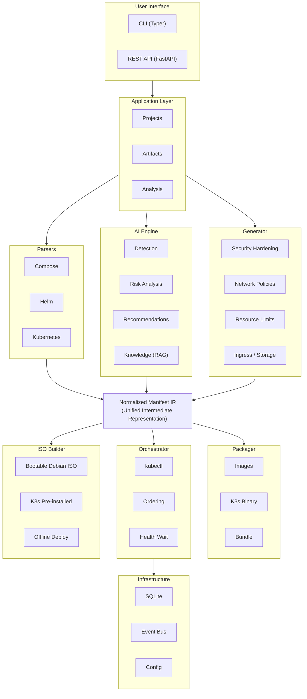
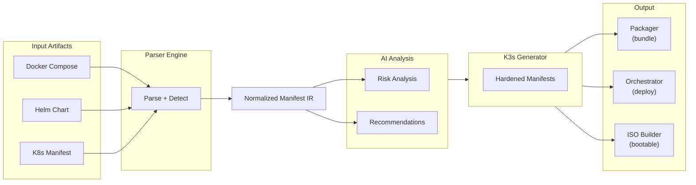
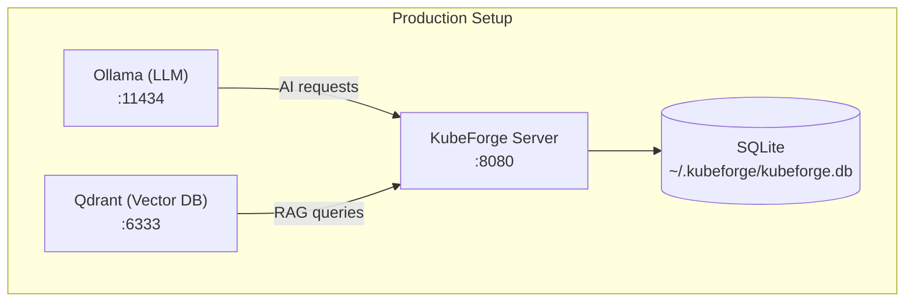

# KubeForge Architecture

This document describes the high-level architecture and design decisions of the KubeForge platform.

## Design Principles

1. **Layered Architecture** — Clear separation between API, business logic, and data access
2. **Format Agnostic** — All input formats are normalized into a single IR before processing
3. **AI as Enhancement** — Core functionality works without AI; LLM features augment the experience
4. **Offline First** — The platform is designed to produce artifacts for air-gapped environments
5. **Convention over Configuration** — Sensible defaults for K3s best practices, overridable when needed

---

## System Overview



---

## Core Components

### 1. Normalized Manifest IR

The central data structure that all parsers produce and all downstream components consume.

```python
class NormalizedManifest:
    namespace: str
    workloads: list[Workload]       # Deployments, StatefulSets
    services: list[Service]         # K8s Services (ClusterIP, NodePort, LB)
    volumes: list[Volume]           # PVCs, ConfigMap volumes, Secrets
    config_maps: list[ConfigData]   # Configuration data
    secrets: list[SecretData]       # Sensitive data
    networks: list[Network]         # Network topology information
    dependencies: list[Dependency]  # Inter-service dependencies
    ingresses: list[Ingress]        # External access definitions
```

**Why?** This abstraction decouples input format parsing from output generation. Adding a new parser (e.g., Pulumi, Nomad) requires only implementing `ManifestParser` — all downstream processing works automatically.

### 2. Parser Engine

Each parser implements the `ManifestParser` protocol:

```python
class ManifestParser(Protocol):
    @property
    def name(self) -> str: ...
    
    @property
    def description(self) -> str: ...
    
    def detect(self, content: str, filename: str = "") -> float:
        """Return confidence score 0.0-1.0 that this parser handles the content."""
        ...
    
    def validate(self, content: str) -> list[ValidationError]:
        """Check content for structural errors."""
        ...
    
    async def parse(self, content: str, options: ParseOptions | None = None) -> NormalizedManifest:
        """Convert content into the normalized IR."""
        ...
```

**Detection strategy**: Parsers use a scoring system (0.0–1.0) combining filename patterns and content heuristics. The parser with the highest confidence score is selected. For ambiguous cases, the AI detector provides LLM-based classification.

### 3. AI Engine

The AI subsystem is modular and provider-agnostic:

```
ai/
├── ollama.py          # OpenAI-compatible client (works with any provider)
├── detector.py        # Artifact type detection
├── risk.py            # Security risk analysis
├── recommendations.py # K3s best-practice suggestions
└── knowledge/         # RAG pipeline
    ├── indexer.py     # Document ingestion into Qdrant
    ├── retriever.py   # Semantic search for relevant context
    └── prompts.py     # Prompt templates
```

**Dual strategy**: Every AI feature has a fast heuristic path (regex/pattern matching) that runs first. The LLM is invoked only when heuristic confidence is low or for deeper analysis. This ensures:
- Core functionality works without any LLM configured
- Fast responses for obvious cases
- Deep analysis when complexity warrants it

### 4. Manifest Generator

Transforms the Normalized Manifest IR into production-ready K3s YAML:

| Output File | Content |
|-------------|---------|
| `00-namespace.yaml` | Namespace with PSA labels (`pod-security.kubernetes.io/enforce: restricted`) |
| `01-serviceaccounts.yaml` | ServiceAccounts with `automountServiceAccountToken: false` |
| `02-configmaps.yaml` | ConfigMap resources |
| `03-secrets.yaml` | Secret resources |
| `04-pvcs.yaml` | PVCs with Longhorn StorageClass |
| `05-workloads.yaml` | Deployments/StatefulSets with security contexts |
| `06-services.yaml` | ClusterIP/NodePort Services |
| `07-ingress.yaml` | Traefik IngressRoutes |
| `08-networkpolicies.yaml` | Default-deny + explicit allow rules |

### 5. Packager

Creates self-contained deployment bundles:

**Lightweight bundle** (`.tar.gz`):
```
bundle/
├── manifests/           # Generated K3s YAML
├── images.txt           # Required container images list
├── registries.yaml      # K3s registry mirror config
├── install.sh           # Bootstrap script
├── checksums.sha256     # File integrity verification
└── README.md            # Deployment instructions
```

**Full ISO** (`.iso`):
```
iso/
├── manifests/           # Generated K3s YAML
├── images/              # Container image tarballs
├── k3s/                 # K3s binary + airgap images
├── install.sh           # Automated setup script
└── checksums.sha256     # File integrity verification
```

### 6. Bootable ISO Builder

Creates a complete Debian 12-based live ISO that:
1. Boots into a minimal environment (no installer interaction)
2. Installs K3s from bundled binary
3. Loads pre-pulled container images via `k3s ctr images import`
4. Applies all Kubernetes manifests
5. Results in a running cluster on first boot

**Build requirements**: `debootstrap`, `squashfs-tools`, `xorriso`, `isolinux`

### 7. Deployment Orchestrator

Applies generated manifests to a live cluster:

```
Deploy Order:
  1. Namespaces + RBAC
  2. ConfigMaps + Secrets
  3. PVCs
  4. PaaS services (databases, message queues)
  5. Wait for PaaS readiness
  6. Application workloads
  7. Services + Ingress
  8. Network Policies
```

Uses the event bus to report progress in real-time.

---

## Data Flow



---

## Database Schema

KubeForge uses SQLite (via `aiosqlite`) for persistence:

| Table | Purpose |
|-------|---------|
| `projects` | Project metadata (name, description, timestamps) |
| `artifacts` | Uploaded deployment files (content, detected type) |
| `analyses` | AI analysis results (risks, recommendations) |
| `generated_manifests` | Generated K8s YAML outputs |
| `images` | Resolved container image references |
| `deployments` | Deployment history and status |

Migrations are stored in `migrations/` and applied automatically on startup.

---

## API Design

The REST API follows resource-oriented design:

```
/api/v1/
├── projects/                    # CRUD for projects
│   ├── {id}/artifacts           # Upload artifacts to a project
│   ├── {id}/analyze             # Trigger AI analysis
│   ├── {id}/manifests           # Generate/retrieve manifests
│   ├── {id}/package             # Create deployment bundle
│   └── {id}/deploy              # Deploy to cluster
├── /health                      # Health check
└── /version                     # Version info
```

**Principles**:
- Standard HTTP methods (GET, POST, DELETE)
- JSON request/response bodies
- Meaningful error responses with `detail` field
- Async handlers for non-blocking I/O
- CORS enabled for frontend integration

---

## Event System

Internal components communicate via an async event bus:

```python
# Events emitted during operations
ARTIFACT_UPLOADED = "artifact.uploaded"
ANALYSIS_STARTED = "analysis.started"
ANALYSIS_COMPLETED = "analysis.completed"
MANIFEST_GENERATED = "manifest.generated"
DEPLOY_STARTED = "deploy.started"
CHART_DEPLOYED = "deploy.chart_applied"
DEPLOY_COMPLETED = "deploy.completed"
DEPLOY_FAILED = "deploy.failed"
```

This enables loose coupling between components and supports future WebSocket-based progress streaming.

---

## Security Model

### Generated Manifests

KubeForge applies defense-in-depth to all generated manifests:

1. **Pod Security Admission** — `restricted` profile enforced at namespace level
2. **Network Policies** — Default-deny ingress/egress with explicit allowlists
3. **Resource Limits** — CPU/memory bounds prevent resource exhaustion
4. **Service Accounts** — Dedicated SA per workload with `automountServiceAccountToken: false`
5. **Security Contexts** — `runAsNonRoot`, `readOnlyRootFilesystem`, dropped capabilities
6. **Secrets Management** — Secrets stored as K8s Secrets (not ConfigMaps)

### Platform Security

- No hardcoded credentials — all sensitive config via environment variables
- API key-based LLM auth (never logged or persisted)
- SQLite database stored in user-controlled directory
- No telemetry or phone-home

---

## Extension Points

### Adding a New Parser

1. Create `src/kubeforge/parsers/new_format.py`
2. Implement `ManifestParser` protocol
3. Register in `parsers/__init__.py`

### Adding AI Capabilities

1. Create a new module under `src/kubeforge/ai/`
2. Use `chat_completion()` from `ai/ollama.py` for LLM calls
3. Always provide a heuristic fallback

### Adding API Endpoints

1. Create a router in `src/kubeforge/api/`
2. Register in `api/__init__.py`

---

## Technology Choices

| Component | Choice | Rationale |
|-----------|--------|-----------|
| Web framework | FastAPI | Async, auto-docs, Pydantic integration |
| CLI | Typer | Type-safe, auto-help, Rich integration |
| Database | SQLite + aiosqlite | Zero-config, embedded, async compatible |
| Config | Pydantic Settings | Type-safe, env-var based, validation |
| LLM client | httpx (OpenAI-compat) | Provider-agnostic, async, well-tested |
| Vector DB | Qdrant | High-performance, REST API, Python SDK |
| Linter/Formatter | Ruff | Fast, replaces Black + isort + flake8 |
| Testing | pytest + pytest-asyncio | Industry standard, async support |
| Build system | Hatch | Modern, PEP 517 compliant |

---

## Deployment Topology



- **Minimal mode**: KubeForge alone (no AI, no Qdrant)
- **AI mode**: KubeForge + Ollama (risk analysis, recommendations)
- **Full mode**: KubeForge + Ollama + Qdrant (AI + knowledge retrieval)
